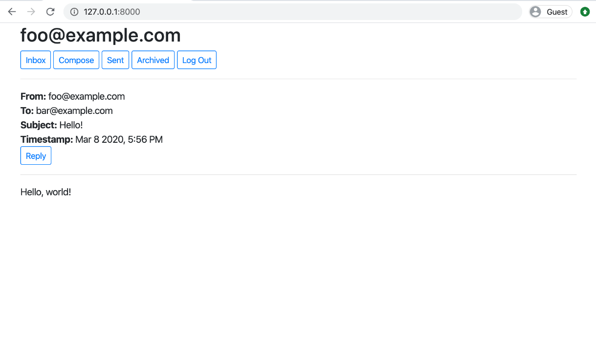

# 📧 Email - Cliente de Email Baseado na Web 

O projeto Email é uma aplicação web que simula as funcionalidades básicas de um cliente de email. Desenvolvido com Django e JavaScript, permite que os usuários enviem, recebam e gerenciem emails através de uma interface interativa e responsiva.



## 🔍 O Que Este Projeto Faz?

### Esta aplicação oferece as seguintes funcionalidades principais:

#### Gerenciamento de Caixa de Entrada: Visualize todos os emails recebidos, com status de lido/não lido. 📨
#### Rastreamento de Enviados: Acesse os emails enviados pelo usuário. ✉️
#### Funcionalidade de Arquivamento: Arquive e desarquive emails para manter a caixa de entrada organizada. 📂
#### Composição de Email: Crie e envie emails com facilidade. ✍️
#### Atualizações Dinâmicas: Interações suaves graças ao JavaScript. ⚡

## 🛠️ Tecnologias Utilizadas

### 1. **Framework Django**  
- **Back-End**: Gerencia o armazenamento de emails, envio e autenticação de usuários.  
- **Django REST Framework**: Fornece APIs para gerenciamento de emails.  

### 2. **JavaScript**  
- **Fetch API**: Lida com requisições assíncronas para atualizações contínuas.  
- **Dynamic Rendering**: Exibe emails e atualiza a interface sem recarregar a página. 

### 3. **HTML and CSS**  
- **HTML**: Estrutura as páginas de caixa de entrada, enviados, arquivados e composição.  
- **CSS**: Estiliza a interface para uma aparência limpa e amigável. 

### 4. **SQLite**  
- Banco de dados para armazenar contas de usuários, dados de emails e status de arquivamento.

---

### 1. Interface do Usuário  
- Os usuários interagem com quatro principais visualizações: 
  - **Inbox**: Mostra os emails recebidos, exibindo o remetente, assunto e status de leitura.
  - **Sent**: Lista todos os emails enviados pelo usuário.
  - **Archive**: Permite aos usuários acessar emails arquivados.  
  - **Compose**:  Fornece um formulário para criar e enviar novos emails.  

### 2. Composição de Email
- Os usuários especificam destinatários, assunto e conteúdo da mensagem.  
- Os emails são enviados e salvos no banco de dados para acesso futuro. 

### 3. Funcionalidade da Caixa de Entrada
- Os emails são carregados de forma dinâmica utilizando a Fetch API.  
- O status de lido/não lido pode ser alternado diretamente na interface.  

### 4. Arquivamento  
- Emails podem ser arquivados ou desarquivados com um único clique.  
- O status de arquivamento é atualizado em tempo real através de chamadas à API.  

### 5. Endpoints da API 
A aplicação usa APIs do Django para lidar com:  
- **Fetching Emails**: Recuperar dados de emails para visualizações de caixa de entrada, enviados ou arquivados.  
- **Sending Emails**: Salvar novos emails no banco de dados e enviá-los aos destinatários.  
- **Updating Status**: Atualizar o status dos emails no banco de dados.  

---

## 📊 Modelos de Banco de Dados

### 1. **User**  
- Utiliza o sistema de autenticação embutido do Django. 

### 2. **Email**  
- **Campos**: `sender`, `recipients`, `subject`, `body`, `timestamp`, `read`, `archived`.  
- **Relacionamentos**: Relaciona-se com usuários para informações de remetente e destinatário.  

---

# Como executar docker

```bash
docker-compose up --build
```
# Executar testes de banco de dados
```bash
python manage.py test
```
´´´bash
# Instalar dependências
```
pip install -r requirements.txt
```
# Fazer migrações:
```bash
python manage.py makemigrations
python manage.py migrate
```
# Executar o servidor
```bash
python manage.py runserver
```

